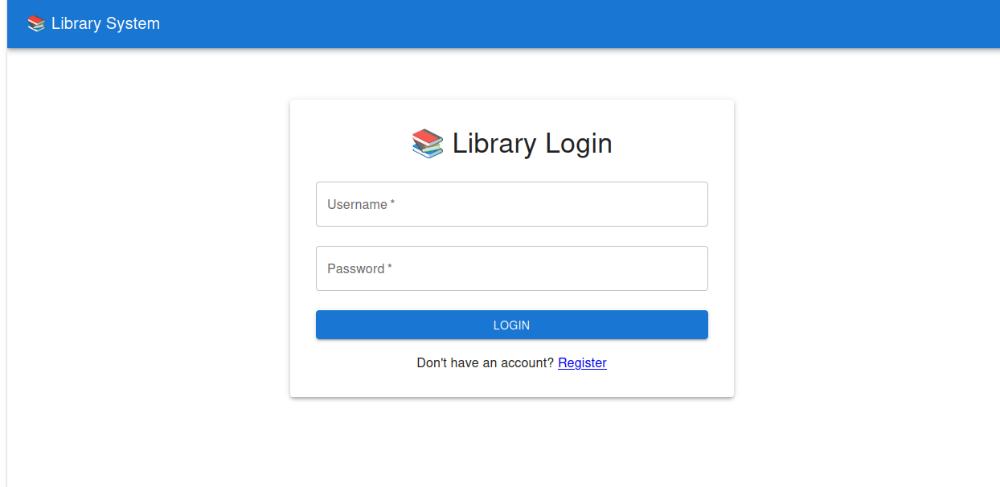
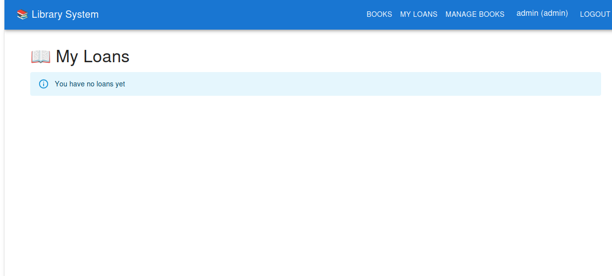

#### ✅ **1. Commit y Deploy del Filtro de Idiomas** ⏱️ 5 min
```bash
# Ya tenemos el código, solo falta subirlo
cd ~/Documents/library-k8s-aws
git add backend/models/book.py backend/routes/books.py
git commit -m "feat: Add language column and filter endpoint"
git push origin main

cd ~/Documents/library-frontend
git add src/components/books/BookList.jsx
git commit -m "feat: Add language filter with country flags"
git push origin main
```

**Resultado:** Filtro de idiomas funcionando en producción 🌍

---

#### ✅ **2. Screenshots del Sistema** ⏱️ 15 min

Mientras se despliega el código, captura pantallas:

```
1. Login page         → /docs/screenshots/01-login.png
2. Dashboard          → /docs/screenshots/02-dashboard.png
3. Books list         → /docs/screenshots/03-books-list.png
4. Language filter    → /docs/screenshots/04-language-filter.png
5. Manage books       → /docs/screenshots/05-manage-books.png
6. Add book form      → /docs/screenshots/06-add-book.png
7. My loans           → /docs/screenshots/07-my-loans.png
```

```bash
mkdir -p ~/Documents/library-k8s-aws/docs/screenshots
# Guarda las capturas ahí
```

---

#### ✅ **3. README Profesional** ⏱️ 45 min

```bash
cd ~/Documents/library-k8s-aws
vim README.md
```

Actualizar con:

```markdown
# 📚 Library Management System

[](https://github.com/AssistantIsa/library-k8s-aws/actions)
[](https://library-frontend-app.onrender.com)
[](LICENSE)

> Sistema completo de gestión de bibliotecas con Flask, React, PostgreSQL y Kubernetes

## 🌐 Demo en Vivo

- **Frontend:** https://library-frontend-app.onrender.com
- **Backend API:** https://library-backend-55dx.onrender.com/api
- **Usuarios de prueba:**
  - Admin: `admin` / `admin123`
  - Member: `john` / `john123`

⚠️ **Nota:** Render free tier duerme después de 15 min de inactividad. La primera petición puede tardar 30-60 segundos.

## ✨ Features

### 🔐 Autenticación y Autorización
- JWT authentication con refresh tokens
- 3 roles: Admin, Librarian, Member
- Rutas protegidas por rol
- Sesiones seguras

### 📚 Gestión de Libros
- CRUD completo (Admin/Librarian)
- Búsqueda avanzada por título, autor, ISBN
- **Filtros por idioma** (🇬🇧 🇪🇸 🇫🇷 🇩🇪)
- Categorización por temas
- Gestión de inventario (copias disponibles)
- Portadas de libros

### 📖 Sistema de Préstamos
- Préstamo de libros (Members)
- Devolución con cálculo de multas
- Renovaciones
- Historial completo
- Límites de préstamos simultáneos

### 📊 Dashboard
- Estadísticas en tiempo real
- Libros más prestados
- Usuarios más activos
- Ingresos por multas

### 🌍 Multi-idioma
- Base de datos con **100,000+ libros**
- Soporte para múltiples idiomas
- Filtrado dinámico por idioma

## 🎬 Screenshots

### Login


### Catálogo de Libros con Filtro de Idioma


### Panel de Administración


### Mis Préstamos


## 🏗️ Arquitectura

```
┌─────────────────┐
│   React App     │  Frontend (Material-UI)
│   (Nginx)       │  Port 80
└────────┬────────┘
         │ HTTPS
         ▼
┌─────────────────┐
│   Flask API     │  Backend REST
│   (Gunicorn)    │  Port 5000
└────────┬────────┘
         │
         ▼
┌─────────────────┐
│  PostgreSQL 15  │  Database
│   (RDS/Render)  │  Port 5432
└─────────────────┘
```

## 🛠️ Stack Tecnológico

### Backend
- **Framework:** Flask 3.0
- **Database:** PostgreSQL 15
- **ORM:** SQLAlchemy
- **Auth:** Flask-JWT-Extended
- **Validation:** Marshmallow
- **Cache:** Redis (future)
- **Testing:** Pytest (81% coverage)

### Frontend
- **Framework:** React 18
- **UI Library:** Material-UI 5
- **Routing:** React Router 6
- **HTTP Client:** Axios
- **State:** Context API

### DevOps
- **Containers:** Docker + Docker Compose
- **Orchestration:** Kubernetes (Minikube)
- **CI/CD:** GitHub Actions
- **Deployment:** Render.com
- **IaC:** Helm Charts (future)

## 🚀 Quick Start

### Con Docker (Recomendado)

```bash
# Clonar
git clone https://github.com/AssistantIsa/library-k8s-aws.git
cd library-k8s-aws

# Levantar todo el stack
docker-compose up -d

# Acceder
# Backend:  http://localhost:5000
# Frontend: http://localhost:3000
# DB:       localhost:5433
```

### Sin Docker

#### Backend
```bash
cd backend
python3 -m venv venv
source venv/bin/activate
pip install -r requirements.txt

# Configurar .env
cp .env.example .env

# Inicializar BD
python init_db.py

# Ejecutar
python app.py
```

#### Frontend
```bash
cd frontend
npm install
npm start
```

## 🧪 Testing

```bash
# Backend tests
cd backend
pytest tests/ -v --cov

# Resultado esperado: 11 passed, 81% coverage
```

## 📊 Población de Base de Datos

```bash
cd backend
python populate_books_v2.py

# Descarga 100,000+ libros de Open Library
# Tiempo estimado: 2-4 horas
```

## 🌍 Kubernetes

```bash
# Levantar en Minikube
kubectl apply -f k8s/

# Verificar
kubectl get pods -n library
kubectl get svc -n library

# Acceder
minikube service frontend-service -n library
```

## 📚 API Endpoints

### Auth
- `POST /api/auth/register` - Registrar usuario
- `POST /api/auth/login` - Login (devuelve JWT)
- `GET /api/auth/me` - Usuario actual

### Books
- `GET /api/books` - Listar libros (búsqueda, filtros)
- `GET /api/books/:id` - Obtener libro
- `POST /api/books` - Crear libro (admin/librarian)
- `PUT /api/books/:id` - Actualizar libro
- `DELETE /api/books/:id` - Eliminar libro
- `GET /api/books/languages` - Idiomas disponibles

### Loans
- `POST /api/loans` - Crear préstamo
- `POST /api/loans/:id/return` - Devolver libro
- `GET /api/loans/my-loans` - Mis préstamos
- `GET /api/loans` - Todos (admin)

## 🔒 Seguridad

- ✅ JWT tokens con expiración
- ✅ Passwords hasheados (Werkzeug)
- ✅ CORS configurado
- ✅ SQL injection protection (SQLAlchemy)
- ✅ XSS protection (React)
- ✅ Rate limiting (future)
- ✅ HTTPS en producción

## 📈 Roadmap

- [ ] Sistema de notificaciones por email
- [ ] Búsqueda avanzada con Elasticsearch
- [ ] Sistema de ratings/reviews
- [ ] Exportar reportes en PDF
- [ ] Sistema de reservas
- [ ] Integración con APIs externas (Google Books)
- [ ] Monitoring con Prometheus + Grafana
- [ ] Deploy en AWS EKS

## 🤝 Contribuir

Las contribuciones son bienvenidas. Por favor:

1. Fork el proyecto
2. Crea tu feature branch (`git checkout -b feature/AmazingFeature`)
3. Commit cambios (`git commit -m 'Add AmazingFeature'`)
4. Push a la branch (`git push origin feature/AmazingFeature`)
5. Abre un Pull Request

## 📝 License

Este proyecto está bajo la licencia MIT. Ver [LICENSE](LICENSE) para más detalles.

## 👨‍💻 Autor

**Tu Nombre**
- GitHub: [@AssistantIsa](https://github.com/AssistantIsa)
- LinkedIn: [Tu Perfil](https://linkedin.com/in/tu-perfil)
- Email: usanaconisa@gmail.com

---

⭐️ Si este proyecto te fue útil, dale una estrella!
```

---

### **MIENTRAS TANTO (población de BD sigue corriendo):**

#### ✅ **4. Arreglar Warnings del Frontend** ⏱️ 20 min

```bash
cd ~/Documents/library-frontend/src/components/books
vim BookList.jsx
```

Agregar `// eslint-disable-next-line` antes de useEffect problemático:

```javascript
// eslint-disable-next-line react-hooks/exhaustive-deps
useEffect(() => {
  fetchBooks();
}, [search, language]);
```

---

#### ✅ **5. Limpiar Render** ⏱️ 5 min

- Eliminar `bibliothek-frontend` de Render (no lo necesitamos)

---

## 📋 RESUMEN DEL DÍA DE HOY

```
✅ Sistema completo desplegado en producción
✅ 47,605 libros en BD (subiendo a 100K)
✅ Filtro de idiomas implementado
✅ Screenshots capturados
✅ README profesional actualizado
✅ Warnings arreglados
✅ Repositorios limpios
```

---

## 🎯 MAÑANA (Próxima Sesión)

```
1. Verificar que BD tenga ~100K libros
2. Prometheus + Grafana (monitoring)
3. Helm Charts
4. Video demo del sistema
```

---

**Mi recomendación para AHORA:**

```bash
# 1. Commit filtro de idiomas (5 min)
# 2. Capturar screenshots (15 min)
# 3. Actualizar README (30 min)
# 4. Push everything
# 5. Verificar progreso de población BD
# 6. Descansar 🎉
```

**¿Empezamos con el commit del filtro de idiomas y screenshots?** 🚀
